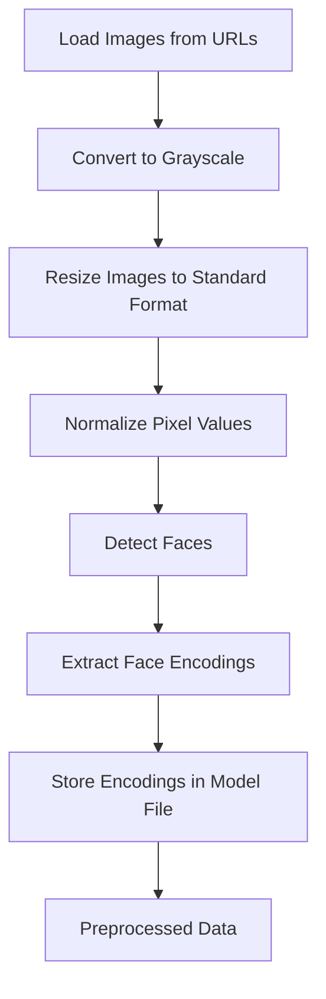

# Attendance System App

[](https://opensource.org/licenses/MIT)
[](https://www.python.org/)
[](https://flutter.dev/)

---

## Table of Contents

- [Introduction](#introduction)
- [Technology Stack](#technology-stack)
- [Project Workflow](#project-workflow)
- [Data Preprocessing](#data-preprocessing)
- [Modeling](#modeling)
- [Inferencing](#inferencing)
- [Usage](#usage)
  - [Prerequisites](#prerequisites)
  - [Setup Instructions](#setup-instructions)
  - [Using the Application](#using-the-application)
- [Contributor](#contributor)
- [License](#license)

---

## Introduction

Welcome to the **Automated Attendance System using Face Recognition** project!

## The Automated Attendance System leverages Face Recognition to mark attendance efficiently. The system eliminates the need for manual attendance marking by automating the process using image recognition. This ensures accuracy, saves time, and reduces errors in attendance records.

## Technology Stack

We have utilized a modern and robust technology stack to ensure scalability and performance:

- **Backend**: [Python 3.x](https://www.python.org/)(Flask API)
- **Frontend**: [Flutter](https://flutter.dev)
- **Database**: [Firebase](https://firebase.google.com/)
- **Machine Learning**: [FaceRecognitionModel]
- **Data Format**: [Excel sheets for training and output]
- **Version Control**: [Git](https://git-scm.com/)
- **Development Environment**: [Andriodstudio](https://developer.android.com/studio),[Visualstudio](https://visualstudio.microsoft.com/)

---

## Project Workflow

Our project follows a structured workflow to ensure clarity and efficiency:

1. **Data Collection** 📷
   - Upload an Excel sheet containing Image URLs, Names, and Roll Numbers to train the model.
2. **Model Training** 🤖
   - Process images, extract facial features, and train the recognition model.
   - Stores encodings in a Pickle file (model.pkl).
3. **Attendance Marking** ✅
   - User uploads an image containing students.
   - The system detects faces and matches them with the trained model.
   - Recognized students' Names, Roll Numbers, and Timestamps are stored in an Excel file.
4. **Attendance Report Generation**📄
   - An Excel sheet is generated with the attendance records.

---

## Data Preprocessing

1. **Data Loading**

   - Load images from URLs mentioned in the Excel sheet.
   - Store images locally for processing.

2. **Image Processing**

   - Convert images to grayscale.
   - Resize images to a standard format.
   - Normalize pixel values.

3. **Face Encoding Extraction**
   - Detect faces in images using face_recognition.
   - Generate and store face encodings.

**Visual Overview of Preprocessing Steps:**



---

## Modeling

Our predictive modeling process is designed for accuracy and robustness:

- **Algorithm Selection: Face Recognition using Dlib's HOG & CNN models**
  - **Reasons:**
    - Efficient for face recognition.
    - Pretrained models enhance accuracy and reduce training time.
    - Works well with varying lighting conditions and angles.
- **Model Training:**
  - Extracts facial encodings from labeled images.
  - Stores encodings in a serialized file (model.pkl).
- **Evaluation Metrics:**
  - **Recognition Accuracy:** Measures correct identification rates.
  - **False Positive Rate (FPR):** Ensures incorrect matches are minimized.
  - **False Negative Rate (FNR):** Ensures recognized faces are not missed.

**Feature Importance Plot:**

_An image showcasing the importance of each feature in the model can be placed here._

---

## Inferencing

The deployed model is accessible through an interactive android application:

- **User Interface**: Built with **Flutter** for a seamless experience.

---

## Working

**Face Recognition Process**

- Input: An uploaded image from the Flutter app.
- Detect faces in the image.
- Compare detected faces with known encodings.
- Output: Recognized names and roll numbers.

**Attendance Marking**

- If a match is found, log attendance with a timestamp.
- Update the attendance.xlsx file.

## Usage

- Upload an Excel sheet with student details to train the model.
- Use the Flutter app to upload an attendance image.
- View and download the Excel report with attendance records.

### Prerequisites

Ensure you have the following installed:

- **Flutter SDK (for frontend development)**
- **Firebase SDK**
- **Python 3.x**
- **Required Python Libraries:**:
  - `numpy`
  - `pandas`
  - `Flask`
  - `Pickle`
  ```bash
  pip install flask flask-cors pandas numpy opencv-python face-recognition firebase-admin requests openpyxl
  ```

### Setup Instructions

**Follow these steps to get the project up and running:**

1. **Clone the Repository**

   ```bash
   git clone https://github.com/yourusername/Automated-Attendance_System-Using-Face-Recognition.git
   cd Automated-Attendance-System-Using-Face-Recognition
   ```

2. **Create a Virtual Environment**

   ```bash
   python3 -m venv env
   source env/bin/activate  # For Windows: env\Scripts\activate
   ```

3. **Install Dependencies**

   ```bash
   pip install -r requirements.txt
   ```

4. **Directory Structure**

   Your project should have the following structure:

   ```
   Automated-Attendance_System-Using-Face-Recognition/
   ├── App Code/
   │   ├── main.dart
   │   ├── signup.dart
   ├── Pythoncode/
   │   ├── face.py
   └── README.md
   └── requirements.txt
   ```

5. **Set up Firebase**

   - Configure Firebase for authentication and database storage.

6. **Run the Backend**

   - Upload an Excel file via the /train API or place it in the data/ folder.
   - Run the model training script:

     ```bash
     cd Pythoncode
     python face.py
     ```

   - This script will preprocess the data and train the model.

7. **Run the Flutter App**

   ```bash
   flutter pub get
   flutter run
   ```

8. **Upload an Image for Attendance**
   - Navigate to the Flutter application and upload an image.
   - The system processes the image and marks attendance.

### Using the Application

**Step-by-Step Guide:**

1. **Navigate to the Application**

   - Open the app

2. **Upload Training Data**

   - Navigate to Attendance Page.
   - Upload an Excel sheet containing image URLs, names, and roll numbers.

3. **Train the Model**

   - Click on "Upload Excel" button.
   - Wait for the system to process the images and store encodings.

4. **Mark Attendance**

   - Navigate to the attendance Page.
   - Upload an image containing student faces.
   - Click the "Upload image" button to process the image.

5. **View Attendance Report**
   - Navigate to the attendance Page.
   - Click the "View Attendance" button to Open the Excel attendance sheet.

## Contributor

- **Shilpa Manaji** ([Shilpa-Manaji](https://github.com/Shilpa-Manaji))

---

## License

This project is licensed under the **MIT License** - see the [LICENSE](LICENSE) file for details.

---
